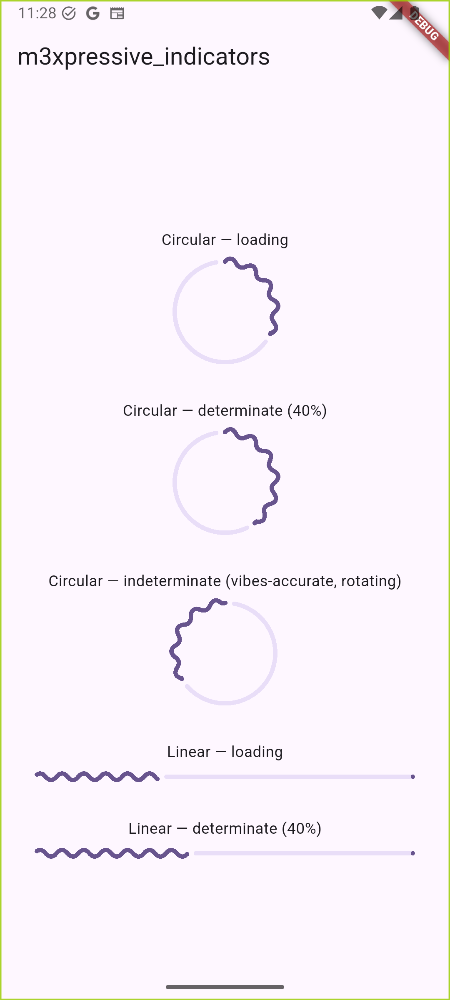

# m3xpressive_indicators

Material 3 Expressive wavy progress and loading indicators for Flutter — circular and
linear, determinate and indeterminate — built to run on older Flutter/Dart SDKs than the
ones the official Material 3 Expressive widgets require.



## Widgets

- `M3XCircularWavyProgressIndicator` / `M3XLinearWavyProgressIndicator` — determinate wavy
  progress indicators. Pass `value: null` for a "loading" mode: the active wave fills from
  empty to full, then repeats.
- `M3XCircularWavyLoadingIndicator` — a vibes-accurate indeterminate circular wavy
  indicator. The active arc grows out from a trailing edge to a randomized peak width, then
  the trailing edge catches up to a randomized (non-zero) resting width, while the whole
  arc rotates around the track. Rotation follows a cycloid motion profile — always forward,
  never reversing, but slowing down and speeding back up once per revolution rather than
  spinning at a constant rate.

## Usage

```dart
import 'package:m3xpressive_indicators/m3xpressive_indicators.dart';

const M3XCircularWavyLoadingIndicator(
  color: Colors.deepPurple,
  size: 96,
);
```

See the `example/` app for all three widgets, determinate and indeterminate, side by side.

See `THIRD_PARTY_NOTICES.md` for attribution — the determinate/loading-fill widgets are
adapted from `package:m3e_progress_indicator`; `M3XCircularWavyLoadingIndicator` is
original work.
